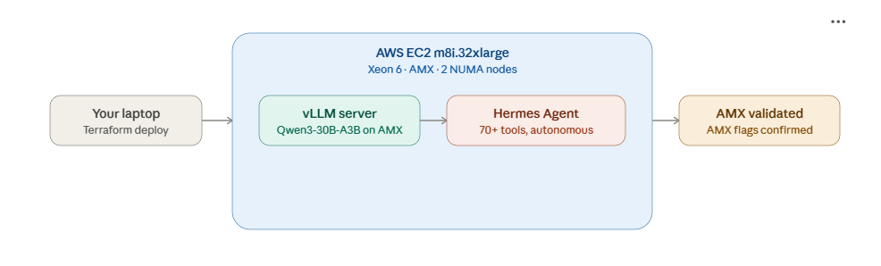

# AWS — Agentic AI on Xeon 6 with Hermes Agent (90 minutes)

Welcome! Follow these steps **in order**. If you get stuck for more than 2 minutes, **raise your hand** — do not silently fall behind.

> Everything in this workshop runs from **Windows PowerShell**. When you see a gray box with commands, copy/paste it into PowerShell.

## What you will build

Deploy an AWS EC2 **Xeon 6** instance with Intel AMX, serve a local LLM with [vLLM](https://github.com/vllm-project/vllm) using AMX-accelerated kernels, and run [Hermes Agent](https://hermes-agent.nousresearch.com/) — an autonomous AI agent by Nous Research — on top of it. You'll watch the agent use tools (terminal, file I/O, code execution) autonomously to complete real tasks on your server.

In order, you will:

1. Deploy an AWS EC2 `m8i.16xlarge` (Xeon 6 with **AMX**, 64 vCPU, 256 GB DDR5).
2. Serve **Qwen3-30B-A3B** (a fast Mixture-of-Experts model) with vLLM's pre-built CPU Docker image — BF16 weights light up the **AMX** matrix tiles, and tensor parallelism puts one worker on each NUMA node.
3. Install Hermes Agent and connect it to the local AMX-accelerated model.
4. Watch the agent autonomously use tools to complete real tasks, then measure AMX inference performance.



---

## 1 Sign in to AWS

You will receive an **email** with sandbox credentials. Run this and follow the prompts:

```powershell
aws configure
# Paste the provided Access Key, Secret
# Region: us-east-1
# Output format: json
```

## 2 Pick your unique name prefix

Pick a short **lowercase** prefix that nobody else will pick — your **first name** works well (e.g., `bob`). Keep it 3–10 letters, no spaces or capitals. **Write it down** — you'll type it in the next step.

---

## 3 Move into the AWS folder

```powershell
cd terraform-aws
```

## 4 Create your `terraform.tfvars`

```powershell
Copy-Item terraform.tfvars.example terraform.tfvars
code terraform.tfvars
```

1. In VSCode, change `name_prefix = "changeme"` to your first name (e.g., `bob`).
2. Remove the comment `#` on line #3 .
3. Save the file.

## 5 Deploy the Intel Xeon 6 instance with Terraform

On the VSCode Terminal run Terraform

```powershell
terraform init
terraform apply 
```

1. Monitor the output. Terraform is telling AWS to create a new EC2 instance, security group, and key pair. The `terraform apply` step shows you the **plan** of what will be created.
2. Enter `yes` to confirm. Terraform will then create the resources.
3. `apply` takes ~2 minutes. When it finishes Terraform prints outputs including `public_ip` and `ssh_command`.

## 6 SSH into the instance and Validate AMX is present

```powershell
ssh -F ssh_config vm
```

> If you're off Intel's network, use `ssh -F ssh_config_no_proxy vm` instead.

You are now logged into an Ubuntu box running on Xeon 6. The shell prompt looks like `ubuntu@ip-...`.

Validate AMX is present

```bash
# Confirm the AMX instruction set is present
grep -o 'amx[a-z_]*' /proc/cpuinfo | sort -u   # expect: amx_bf16, amx_int8, amx_tile
```

Validate CPU
```bash
lscpu
```

Validate NUMA nodes and capture the count for vLLM
```bash
lscpu | grep "NUMA node(s):"

# Save the count — step 8 uses it to size tensor parallelism
export NUMA_NODES=$(lscpu | awk '/^NUMA node\(s\):/{print $3}')
echo "NUMA nodes: $NUMA_NODES"
```

> If you reconnect to the instance later, re-run the `export NUMA_NODES=...` line before step 8.

## 7 Install Docker and set your HuggingFace token

We run vLLM as a Docker container — no Python environments or system packages to manage. vLLM downloads the model straight from HuggingFace and serves an OpenAI-compatible API.

```bash
# 1. Install Docker and jq (used later to parse API responses)
sudo apt-get update -qq && sudo apt-get install -y docker.io jq
# 2. Allow your user to run Docker without sudo
sudo usermod -aG docker $USER && newgrp docker
# 3. Verify Docker is working
docker --version
```

```bash
# 4. Set your HuggingFace token for faster, un-throttled downloads
export HF_TOKEN=<your-token-from-email>
```

> Your instructor will provide the `HF_TOKEN`. A token avoids HuggingFace's anonymous rate limits on large downloads. With your own account you can create one at <https://huggingface.co/settings/tokens> (read-only is enough).

## 8 Start vLLM with AMX, NUMA-aware tensor parallelism, and tool calling

vLLM ships a pre-built CPU image that already includes the AMX-optimized kernels. We launch it with **one tensor-parallel worker per NUMA node**, so all of the instance's memory bandwidth feeds a single request. BF16 weights are what light up the AMX matrix tiles.

<!-- Other LLM options
- NousResearch/Hermes-4-14B 
- Qwen/Qwen3-30B-A3B-Instruct-2507
- informatiker/Hermes-3-Llama-3.1-8B-AWQ-INT4

Other choices 
- warshanks/Hermes-4-14B-AWQ
  
- cyankiwi/Hermes-4-14B-AWQ-8bit  
- cyankiwi/Hermes-4-14B-AWQ-4bit
- warshanks/Hermes-4-14B-AWQ
- informatiker/Hermes-3-Llama-3.1-8B-AWQ-INT4
- solidrust/Hermes-3-Llama-3.1-8B-AWQ
- cyankiwi/Hermes-4-14B-AWQ-8bit
- RedHatAI/Qwen2.5-32B-Instruct-quantized.w8a8
- JunHowie/Qwen3-32B-GPTQ-Int8
- JunHowie/Qwen3-14B-GPTQ-Int8
- devpramod-intel/Qwen3-8B-quantized.w8a8
- RedHatAI/Qwen2.5-32B-Instruct-quantized.w8a8
- ktoprakucar/Hermes-3-Llama-3.1-8B-Q8-GPT -->

```bash
# Start vLLM (first run downloads ~61 GB from HuggingFace — a few minutes)
docker run -d --name vllm \
  --network host \
  --cap-add SYS_NICE \
  --security-opt seccomp=unconfined \
  --shm-size=16g \
  -v /home/ubuntu/.cache/huggingface:/root/.cache/huggingface \
  -e HF_TOKEN=$HF_TOKEN \
  -e VLLM_CPU_KVCACHE_SPACE=40 \
  -e VLLM_CPU_OMP_THREADS_BIND=auto \
  vllm/vllm-openai-cpu:v0.21.0-x86_64 \
  Qwen/Qwen3-30B-A3B-Instruct-2507 \
  --served-model-name qwen3-30b \
  --tensor-parallel-size ${NUMA_NODES} \
  --dtype bfloat16 \
  --enable-auto-tool-choice \
  --tool-call-parser hermes \
  --host 127.0.0.1 --port 8000

echo "vLLM starting... (first run downloads model weights)"
until curl -fs http://127.0.0.1:8000/health > /dev/null 2>&1; do echo "waiting for vLLM..."; docker logs --tail 4 vllm 2>/dev/null; sleep 5; done
echo "vLLM is up and serving with AMX + tool calling"
```

> **What do the environment variables do?**
>
> | Variable | Purpose |
> |---|---|
> | `VLLM_CPU_KVCACHE_SPACE=40` | KV cache size in GiB **per NUMA node** (plenty for a single-user agent) |
> | `VLLM_CPU_OMP_THREADS_BIND=auto` | Bind each tensor-parallel worker's threads to its own NUMA node |

> **Key vLLM flags:**
> - `--tensor-parallel-size ${NUMA_NODES}` — one worker per NUMA node, so all of the instance's memory bandwidth serves each token. Uses the value you captured in step 6.
> - `--dtype bfloat16` — **Required** for the AMX matrix tiles (this is vLLM's equivalent of llama.cpp's `GGML_AMX=ON`).
> - `--enable-auto-tool-choice --tool-call-parser hermes` — **Required** for tool/function calling. Qwen3 emits Hermes-style tool calls; without these, Hermes Agent cannot execute tools. (This replaces llama.cpp's `--jinja`.)

> **Docker flags:** `--network host` lets vLLM listen directly on `127.0.0.1:8000`. `--cap-add SYS_NICE` and `--security-opt seccomp=unconfined` enable NUMA-aware thread and memory binding. `--shm-size=16g` gives the tensor-parallel workers shared memory to communicate through.

> **Why Qwen3-30B-A3B-Instruct-2507?** Hermes Agent needs strong tool calling **and** low latency. This is a Mixture-of-Experts model — 30.5B total parameters but only **3.3B active per token** — so it decodes on CPU like a small model while answering like a large one. It has native tool-calling training, responds directly with no hidden "thinking" tokens, ships in **BF16** (so the AMX kernels engage), natively supports a **256K context window** (so no rope-scaling overrides are needed), and is Apache 2.0 licensed.

<!-- Confirm the model is being served:

```bash
curl -s http://127.0.0.1:8000/v1/models | jq '.data[].id'   # expect: "qwen3-30b"
``` -->

## 9 Install Hermes Agent

[Hermes Agent](https://hermes-agent.nousresearch.com/) is an autonomous AI agent built by [Nous Research](https://nousresearch.com/). Unlike a simple chatbot, it has a **learning loop** — it creates skills from experience, uses 70+ built-in tools (terminal, file I/O, web search, code execution), and improves over time.

```bash
# Install Hermes Agent (handles Python, Node.js, ripgrep, ffmpeg automatically)
curl -fsSL https://raw.githubusercontent.com/NousResearch/hermes-agent/main/scripts/install.sh | bash
```

**NOTE:**
- At the end of the installer, it will launch a setup wizard on asking **"How would you like to set up Hermes?"**
- When it does, press **Ctrl+C** two times to skip it, we'll configure the Hermes Agent manually in the next step.

## 10 Configure Hermes Agent to use the local model

Point Hermes Agent at your local vLLM server. This tells it to use your AMX-accelerated model instead of a cloud API:

```bash
# Configure the LLM provider as a custom local endpoint
source ~/.bashrc
hermes config set model.provider custom
hermes config set model.default "qwen3-30b"
hermes config set model.base_url "http://localhost:8000/v1"
# Match vLLM's served window (--max-model-len). Must be >= 64,000 or Hermes refuses to start.
# hermes config set model.context_length 262144
```

<!-- Verify the configuration:

```bash
hermes doctor
```

You should see your model and provider listed without errors. -->

## 11 Run your first agentic conversation

Start Hermes Agent in interactive mode:

```bash
hermes chat
```

You'll see a welcome banner showing your model (`qwen3-30b`), available tools, and a prompt. **This is not a chatbot** — it's an agent that can autonomously execute commands, read/write files, and chain multi-step tasks.

Type this first prompt to verify tool use works:

```
What directory am I in? List the files here and tell me about this system.
```

> **Timing:** Each inference turn takes a few seconds on CPU with AMX acceleration. Because Qwen3-30B-A3B is a Mixture-of-Experts model (only 3.3B of its 30.5B parameters are active per token), it decodes far faster than a dense model of similar quality, and it responds directly without hidden "thinking" tokens. Multi-step tasks with several tool calls take about 1-3 minutes total.

The agent should:
1. Run `pwd` to check the current directory
2. Run `ls` to list files
3. Possibly run `uname -a` or `lscpu` to gather system info
4. Synthesize the results into a coherent answer

> **What's different from a chatbot?** A chatbot generates text. Hermes Agent **takes action** — it decides which tools to call, executes them, reads the output, and iterates. You'll see it "thinking" and running commands in real-time.

### Six more prompts for exploring agentic AI

These prompts are short and self-contained, so the agent finishes quickly. Each one highlights a different agentic capability — running commands, reading and writing files, executing code, and building small reusable tools — using only what's already on this machine.

#### 1. Quick system snapshot

```text
In one short paragraph, tell me this server's CPU model, total number of cores, and total RAM. Keep it brief. And tell me if this system supports Intel AMX.
```

#### 2. Create and read a file

```text
Create a folder called ~/demo and write a file named system.txt inside it containing this machine's CPU model and today's date. Then show me the contents of the file.
```

#### 3. Build and run a small app

```text
Write a short Python script at ~/demo/pi.py that estimates Pi with the Monte Carlo method, using the multiprocessing module to spread 20 million random points across every CPU core. Print the number of cores used, the estimate, and how many seconds it took. Standard library only, plain text, no colours. Then run it and show me the output.
```

> **What you're looking at:** the script fans 20 million random points out across all 64 vCPUs of this Xeon 6 and finishes in a couple of seconds.

#### 4. Create and run your own command

```text
Create a small reusable command: write a short shell script at ~/bin/greet that prints a friendly one-line summary of this machine — its hostname, how long it has been up, and the current load average. Make the script executable, then run it and show me the output.
```

#### 5. Check the local model server

```text
Check whether the local vLLM server is healthy by calling http://127.0.0.1:8000/health, and find out which model it is serving at http://127.0.0.1:8000/v1/models. Answer in two lines.
```

#### 6. Show the top memory users

```text
Show me the top 3 processes by memory usage right now, and briefly say what each one is.
```

<!-- ## 13 Measure inference performance with AMX

Exit hermes with `/quit` or `Ctrl+D`. Back in the regular shell, check vLLM's built-in metrics:

Back in the regular shell (after exiting Hermes), send a request straight to vLLM's OpenAI-compatible API and read the token counts:

```bash
curl -s http://127.0.0.1:8000/v1/completions \
  -H "Content-Type: application/json" \
  -d '{
    "model": "qwen3-30b",
    "prompt": "Explain how Intel AMX (Advanced Matrix Extensions) accelerates AI inference workloads on Xeon processors.",
    "max_tokens": 50,
    "stream": false
  }' | jq '{prompt_tokens: .usage.prompt_tokens, generated_tokens: .usage.completion_tokens, total_tokens: .usage.total_tokens}'
```

For precise timing, read vLLM's built-in Prometheus metrics — the two numbers that matter are time-to-first-token (prefill) and time-per-output-token (decode):

```bash
curl -s http://127.0.0.1:8000/metrics | grep -E "vllm:(time_to_first_token|time_per_output_token)_seconds" | grep -v "#" | head
```

| Metric | What it measures | Bottleneck |
|---|---|---|
| Time to first token (TTFT) | How fast the model digests the prompt before generating | **Compute-bound** — this is where the AMX matrix tiles dominate |
| Time per output token (TPOT) | How fast the model emits each new token | **Memory-bandwidth bound** — the instance's DDR5 bandwidth across all NUMA nodes (via tensor parallelism) helps here |

TTFT is the key AMX metric: with long prompts or batched requests, prefill dominates total latency, and that's exactly the compute-bound regime AMX accelerates. -->

## 12 Teardown — DO NOT SKIP

When you're done exploring, first leave the hermes chat (type `/quit`) and then the SSH session (type `exit`) to return to Windows PowerShell. Then tear everything down so the sandbox stops billing:

```powershell
cd $HOME\solutions-execution\workshop\cloud-workshop\terraform-aws
terraform destroy
```

1. Review the plan. Terraform shows you everything it will **destroy** (the EC2 instance, security group, and key pair).
2. Enter `yes` to confirm. Terraform tears down the resources and ends with `Destroy complete!`.

**Show your screen to a workshop assistant before you leave.**

---

## You did it


In this workshop you:

- Used VSCode, Git, the AWS CLI, and Terraform for the first time.
- Deployed an AWS EC2 Xeon 6 instance and served **Qwen3-30B-A3B** with vLLM, using AMX-optimized kernels and NUMA-aware tensor parallelism.
- Installed **Hermes Agent** — an autonomous AI agent by Nous Research — and connected it to a local LLM running on Intel AMX.
- Watched the agent **autonomously use tools** (terminal commands, file I/O, code execution) to complete real tasks — going far beyond simple chatbot Q&A.
- Measured prefill and decode performance powered by Intel AMX.

That's the full stack: Intel silicon → open-source inference engine → autonomous AI agent. All running locally on your server with zero cloud API dependencies.

---

## Appendix — If something goes wrong

| You see | What it means | What to do |
| --- | --- | --- |
| `cannot be loaded because running scripts is disabled on this system` | PowerShell execution policy | Run `Set-ExecutionPolicy -Scope CurrentUser -ExecutionPolicy RemoteSigned`, then retry |
| `git` / `terraform` / `code` / `gcloud` `not recognized` right after install | PowerShell PATH is cached | **Close PowerShell, open a new one**, retry |
| `terraform apply` → `InsufficientInstanceCapacity` | Region/AZ ran out of `m8i` capacity | **Raise your hand** — instructor will switch the region |
| `ssh -F ssh_config vm` → "Connection refused" | Instance still booting (sshd not up yet) | Wait ~30s and retry |
| SSH → hangs at `connecting...` forever | `ssh_config` uses Intel proxy; you're off Intel network | Use `ssh -F ssh_config_no_proxy vm` instead |
| `docker: permission denied` while connecting to the Docker daemon | Docker group membership not active yet | Run `newgrp docker` (or log out and SSH back in), then retry |
| vLLM download looks frozen | First-time pull of a ~61 GB model — just slow | Be patient; if it errors, run `docker stop vllm && docker rm vllm` and re-run the `docker run` (it resumes from the cached volume) |
| vLLM download → `401 Unauthorized` or rate-limited | `HF_TOKEN` not set or expired | Re-run `export HF_TOKEN=<token>` from step 7, then `docker stop vllm && docker rm vllm` and re-run the container |
| vLLM exits with `OOM` / `exitcode 9` | KV cache + model shard too large for one NUMA node | Lower `VLLM_CPU_KVCACHE_SPACE` (e.g. `20`) or `--max-model-len`, then restart the container |
| `NotImplementedError: No Int8 MoE backend supports the deployment configuration` | `--model` points at a **quantized** (INT8/INT4) build — vLLM's MoE quant kernels are GPU-only, not available on the CPU image | Use the **BF16** model `Qwen/Qwen3-30B-A3B-Instruct-2507`, then `docker stop vllm && docker rm vllm` and re-run the container |
| `curl :8000/v1/models` shows nothing / container not running | vLLM crashed during load | Run `docker ps`, then `docker logs vllm` to see the error |
| `hermes` → "command not found" | Shell not reloaded after install | Run `source ~/.bashrc` and retry |
| `hermes` → empty or broken replies | Model/endpoint config wrong | Run `hermes doctor`, verify vLLM is up (`curl http://127.0.0.1:8000/health`) |
| `hermes` → "Context limit" error at startup | Hermes context longer than vLLM's | Ensure `model.context_length` matches vLLM's `--max-model-len` (both `262144` here) |
| `hermes` → tool calls appear as text (raw JSON) | tool-calling flags missing on vLLM | Restart vLLM with `--enable-auto-tool-choice --tool-call-parser hermes` |
| `terraform destroy` says `Error: ... still in use` | A previous `apply` was interrupted | Re-run `terraform destroy` once more (type `yes`); it usually clears |

When in doubt: from the `cloud-workshop` folder, run `.\prereqs\verify-tools.ps1` again — it confirms every tool is present and on PATH.

---

## Appendix — What is Hermes Agent?

[Hermes Agent](https://hermes-agent.nousresearch.com/) is an open-source (MIT license) autonomous AI agent built by [Nous Research](https://nousresearch.com/). Key features:

- **70+ built-in tools** — terminal commands, file operations, web search, browser automation, code execution, image generation, and more.
- **Self-improving** — creates skills from experience and reuses them. Persistent memory across sessions.
- **Runs anywhere** — local machine, Docker, SSH, serverless (Daytona, Modal). Not tethered to an IDE.
- **Any LLM backend** — works with Ollama, llama.cpp, vLLM, or any OpenAI-compatible API.
- **Multi-platform** — CLI, Telegram, Discord, Slack, WhatsApp, Email, and 20+ messaging platforms.

Learn more: [Documentation](https://hermes-agent.nousresearch.com/docs/) | [GitHub](https://github.com/NousResearch/hermes-agent) | [Discord](https://discord.gg/NousResearch)
