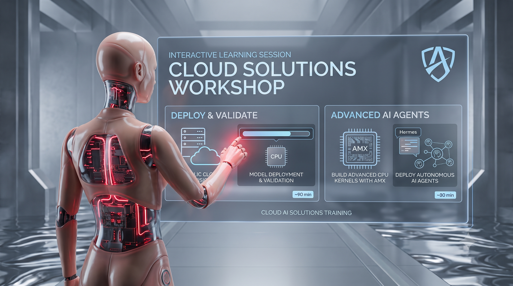
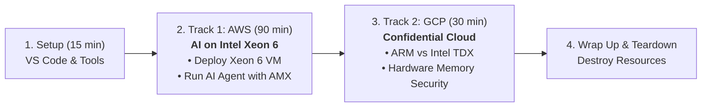

<div align="center">
  
</div>

# Intel Xeon in the Cloud Interactive Learning: Deploy & Validate Intel Xeon w/ AMX and TDX in the Public Cloud

A hands-on workshop that takes Intel Technical Sellers from **never having opened VSCode** to **deploying and validating Intel features in the cloud**.


### Workshop flow overview



After a one-time setup, you choose your track — **AWS**, **GCP**, or **both**. Each track is self-contained: do either one on its own, in any order.

> Audience: 30 Intel Technical Sellers, no prior experience with VSCode, Git, CLIs, cloud consoles, or Terraform.
> Duration: 2 hours (setup + one or both tracks).
> Platform: **Windows laptop + PowerShell**.

## 1 Setup (15 minutes)

You will install **5 tools**. We give you two paths — pick **one**:

- **Path A — Automated (recommended, ~5 minutes):** one PowerShell script installs everything via `winget`.
- **Path B — Manual (~10 minutes):** click each download link, run each installer. Use this if `winget` is blocked on your machine.

## 1.1 Open PowerShell

Press the `Windows` key, type `powershell`, press Enter. A Terminal should open.

---

## 1.2 Install Required Tools

### Path A — Automated install (recommended)

Copy/paste this entire block into PowerShell and press Enter:

```powershell
# 1. Install Git first (the script needs it to clone the repo)
Set-ExecutionPolicy -Scope CurrentUser -ExecutionPolicy RemoteSigned
winget install --id Git.Git --exact --silent --accept-package-agreements --accept-source-agreements
```

**Close PowerShell, open a new one** (so `git` is on your `PATH`), then:

```powershell
cd $HOME
git clone https://github.com/lucasmelogithub/solutions-execution.git
cd solutions-execution\workshop\cloud-workshop
.\prereqs\install-tools.ps1
```

The script installs: VSCode, AWS CLI, Google Cloud SDK, Terraform. It takes ~5 minutes.

```powershell
cd $HOME\solutions-execution\workshop\cloud-workshop
```

When it finishes, **close PowerShell and open a new one** (so the new tools land on your `PATH`), then return to the folder and continue to step 1.3:

---

<details>
<summary><strong>OPTIONAL: Path B — Manual install (use only if winget is blocked)</strong></summary>

Install these **in order**. For each one: click the link, download the **64-bit Windows installer**, run it, click **Next → Next → Install** with the default options.

| # | Tool | Download link | What to install |
|---|------|---------------|------------------|
| 1 | **Git** | <https://git-scm.com/download/win> | "64-bit Git for Windows Setup" |
| 2 | **Visual Studio Code** | <https://code.visualstudio.com/Download> | "Windows" → "User Installer" 64-bit. **On the "Select Additional Tasks" screen, tick "Add to PATH"** |
| 3 | **AWS CLI v2** | <https://awscli.amazonaws.com/AWSCLIV2.msi> | Direct MSI download — just run it |
| 4 | **Google Cloud SDK (gcloud)** | <https://dl.google.com/dl/cloudsdk/channels/rapid/GoogleCloudSDKInstaller.exe> | Direct EXE — accept all defaults; let it run `gcloud init` at the end (or skip and run it later) |
| 5 | **Terraform** | <https://developer.hashicorp.com/terraform/install> | "Windows / AMD64" zip → unzip → put `terraform.exe` somewhere on your `PATH` (easiest: `C:\Windows\System32\terraform.exe`) |

After all 5 are installed, **close PowerShell and open a new one** (PowerShell only sees new tools after a restart). Then clone the workshop repo:

```powershell
cd $HOME
git clone https://github.com/lucasmelogithub/solutions-execution.git
cd solutions-execution\workshop\cloud-workshop
```

</details>

---

## 1.3 Verify everything is installed


```powershell
cd $HOME
cd solutions-execution\workshop\cloud-workshop
.\prereqs\verify-tools.ps1
```

You should see green `[ OK ]` on every line (`git`, `code`, `aws`, `gcloud`, `terraform`, `ssh`, `connect`). If any line is red `[FAIL]` — **raise your hand**.

## 1.4 Open the project in VSCode

```powershell
code .
```

## 1.5 Open a Terminal in VSCode

After VSCode opens. In the top menu choose **Terminal → New Terminal**. That terminal is also PowerShell — use it for the rest of the workshop.

## 2 Workshop

We suggest starting with the AWS track. Each file is complete on its own and includes its own sign-in, deployment, and teardown.

| Track | What you'll do | Time |
|-------|----------------|------|
| [**AWS** — Agentic AI on Xeon 6](./1_AWS_INSTRUCTIONS.md) | Deploy a Xeon 6 EC2 instance, build llama.cpp with Intel AMX, and run an autonomous AI agent (Hermes) on a local model. | ~90 min |
| [**GCP** — Intel TDX Confidential VMs on Xeon](./2_GCP_INSTRUCTIONS.md) | Deploy an ARM VM, prove it has no Intel TDX, then switch to a `c3` Confidential VM and confirm Intel TDX is active. | ~30 min |

> Each track ends with its own **teardown** step — don't skip it, or the sandbox keeps billing.
